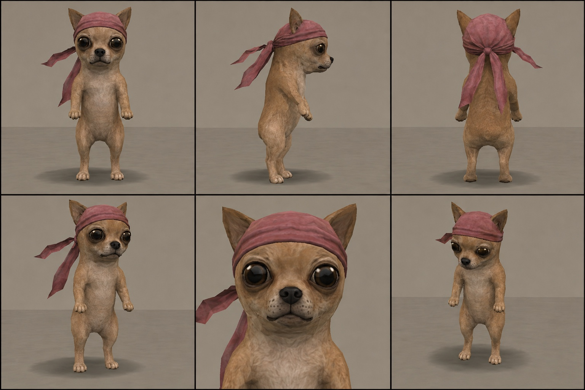
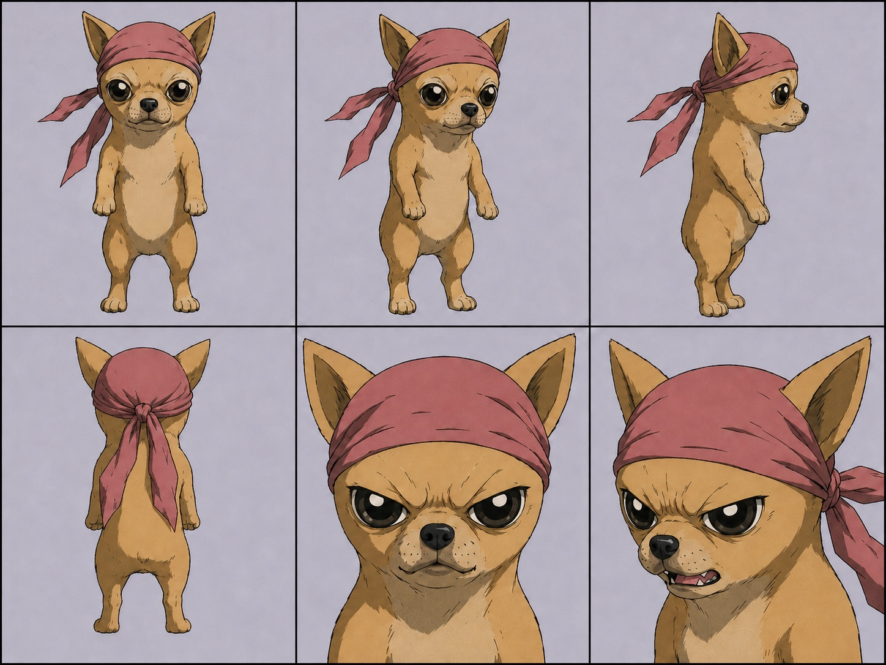
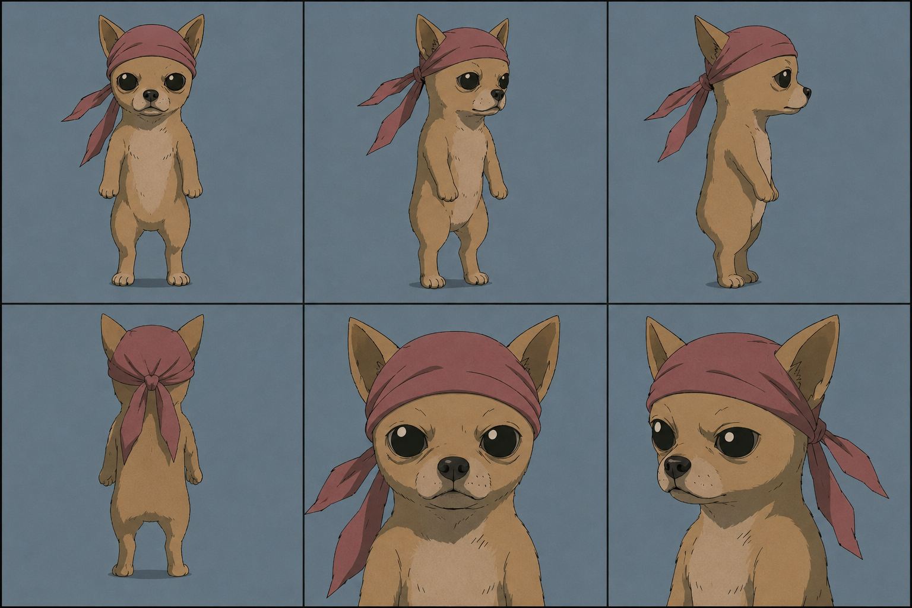

# Chihuahua Community Engine

An easy creative tool for making images and short videos with Nosimaj Media's pink-durag Chihuahua.

You do not need to know prompting.

Tell the Engine what Chihuahua is doing. It handles the character, old-game graphics, registered visual styles, camera direction, continuity, storyboards, animation prompts, and common repairs.

## What you need

- **A paid ChatGPT plan.** Personal Skills are not available on Free or Go. On a managed workspace, an admin may need to turn Skills on.
- **Image generation in ChatGPT** for pictures. The Engine makes the image right in the chat.
- **A video tool for video.** The Engine does not render video itself. For MINI, SCENE, BUMPER, and FAKE AD it writes the prompt; you paste that into fal.ai MiniMax H3 Max, Seedance, Kling, or another video tool. Those are separate products, not part of ChatGPT.

## Install in ChatGPT

Install from chatgpt.com in a browser. If you also use the desktop app, add the Skill there separately.

1. Download [chihuahua-community-engine.zip](https://github.com/nosimajtechnology/chihuahua-community-engine/releases/latest/download/chihuahua-community-engine.zip). **Do not unzip it.**
2. In ChatGPT, open **Plugins** from the sidebar, then **Skills** → **Create** → **Upload from your computer**, and pick the zip.
3. Start a new chat.

Use this as your first prompt:

```
Load the "Chihuahua Community Engine" skill.
```

Then describe your idea:

```
Make an image of Chihuahua managing a cheap motel.
```

If the picture looks right, reply `Approved.` If something is off, say exactly what:

```
He has four legs. Fix only that.
```

## What you can make

- **IMAGE** — one picture
- **MINI** — quick animated moment
- **SCENE** — short cinematic
- **BUMPER** — short loop
- **FAKE AD** — fictional commercial

You can name a mode or let the Engine choose. IMAGE comes back as a picture; the other four come back as a first frame to approve, then a prompt for your video model.

## Styles and H3 Max routes

The Engine now offers **Flagship PS2**, **Late-Z Battle Cel**, and **Late-90s
OVA Crime/Action** after mode selection. For fal.ai MiniMax H3 Max video:

- **Classic Control / I2V** keeps the approved Genesis Frame as the literal
  opening frame and uses the storyboard as planning authority.
- **Direct Explore / T2V** creates self-contained text-only concepts with no
  references.
- **Character Lock / R2V** uses the approved Late-Z Chihuahua sheet as `Image 1`
  and the only default reference when Late-Z is active. Other styles keep their
  existing reference setup.

## Source of truth

The installable, canonical Skill lives in
[`skill/chihuahua-community-engine/`](./skill/chihuahua-community-engine/).
Release ZIPs are built from that folder; the older top-level package is retained
only for compatibility.

## Canonical Character Reference

This turnaround is the official visual identity reference for keeping the same Chihuahua across community creations. Keep the pink durag, head shape, eyes, body proportions, fur color, and silhouette consistent; scenes, outfits, props, poses, and expressions may change.



## Style reference sheets

These approved sheets are bundled with the Engine and displayed here without
alteration.

### Late-Z Battle Cel



### Late-90s OVA Crime/Action



## Need an idea?

- Browse the [community idea starters](./COMMUNITY_IDEAS.md) — thirty one-liners, plus thirty more sorted by mode.
- Try one of the [starter examples](./examples/README.md).
- Read the [community guide](./docs/COMMUNITY_GUIDE.md) for the questions everyone asks first, or keep the [quick command card](./docs/QUICK_COMMAND_CARD.md) open.

Copy an idea, change anything you want, and let the Engine handle the production details.

## Community use

Same recognizable Chihuahua. Different people's ideas.

Community creations are unofficial by default. They are not automatically Nosimaj Media canon.

Suggested credit:

> Chihuahua character by Nosimaj Media. Community-created scene.

### Join the community

See what others are creating, share your Chihuahua scenes, and find new ideas in the [Chihuahua Community on X](https://x.com/i/communities/2013614394538668190).

This is a creative-production tool. It does not provide token trading advice, investment recommendations, price targets, or financial promises.

Learn more about Nosimaj Media at [nosimaj.com](https://nosimaj.com).

## License

Two licenses, one line between them: the tooling and the words are open; the Chihuahua is not.

| Material | License |
|---|---|
| The Skill's instructions — `SKILL.md`, `agents/openai.yaml`, and the `references/*.md` rules inside the install zip | [MIT](./LICENSE) |
| Everything else written — this README, the package docs (`2_START_HERE` … `6_QUICK_COMMAND_CARD`), `COMMUNITY_IDEAS.md`, `COMMUNITY_TRANSMISSIONS.md`, the release notes, `examples/`, and any scripts | [MIT](./LICENSE) |
| The Chihuahua — `assets/chihuahua-character-sheet.png`, the reference images inside the install zip (`chihuahua-character-sheet.png`, `CHIHUAHUA_MASTER_REFERENCE.jpg`), the character's name, and his visual identity | [Chihuahua Community Asset License](./ASSET_LICENSE.md) |

The asset license lets you make and share unofficial Community Engine images and videos, ordinary social-platform monetization included. Merchandise, products, client work, competing packs, token or NFT projects, and anything that implies an official stamp need written permission from Nosimaj Media LLC.

Copyright © 2026 Nosimaj Media LLC.

Want to add an idea, fix a typo, or report a problem? See [CONTRIBUTING.md](./CONTRIBUTING.md).
